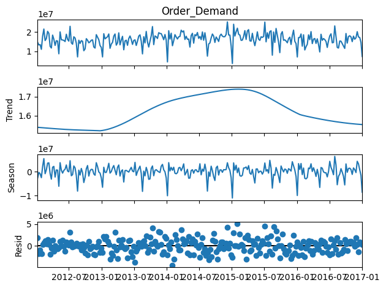
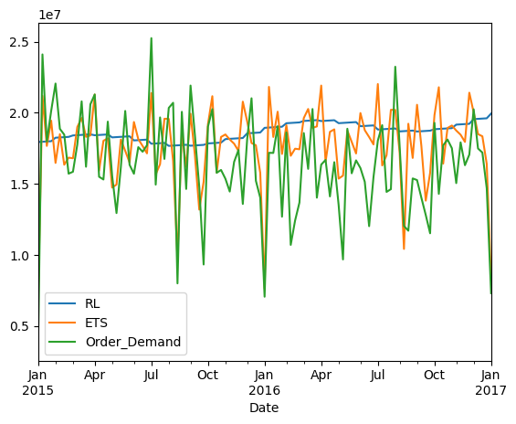

# Projeto de previsão de demanda

Este repositório apresenta um projeto completo de **previsão de demanda** para uma empresa com atuação global, múltiplos centros de distribuição e milhares de produtos distribuídos em diversas categorias. O projeto foi desenvolvido em Python, utilizando um Google Colab, e segue todas as etapas da metodologia **CRISP-DM**, do entendimento do negócio até a comunicação dos resultados.

O objetivo principal é demonstrar capacidade analítica, visão de negócio e aplicação prática de modelos de séries temporais em um contexto realista de supply chain.

---

## Visão geral do problema

Empresas globais enfrentam grandes desafios para prever demanda devido a:

* grande volume de produtos (SKUs)
* múltiplas categorias com comportamentos distintos
* sazonalidade e tendência ao longo do tempo
* impacto direto no planejamento de estoques e custos operacionais

Neste projeto, os dados são analisados para identificar a **categoria de produto mais relevante**, que é então utilizada como foco para o desenvolvimento do modelo de previsão.

---

## Metodologia

O projeto segue a metodologia **CRISP-DM**, estruturada da seguinte forma:

1. **Entendimento do negócio**
   Definição do problema de previsão de demanda e seus impactos operacionais.

2. **Entendimento dos dados**
   Análise exploratória, estatísticas descritivas, volume por categoria e comportamento temporal.

3. **Preparação dos dados**
   Limpeza, tratamento de datas, transformação da variável de demanda e agregações temporais.

4. **Modelagem**
   Desenvolvimento e comparação de dois modelos:

   * Regressão linear com componentes de tendência e sazonalidade
   * Modelo ETS (exponential smoothing)

5. **Avaliação**
   Avaliação dos modelos com métricas de erro e análise visual das previsões.

6. **Comunicação dos resultados**
   Visualização das previsões e interpretação dos resultados obtidos.

---

## Dados

* Fonte: conjunto de dados público de previsão de demanda ([Kaggle](https://www.kaggle.com/datasets/felixzhao/productdemandforecasting))
* Frequência original: diária
* Frequência utilizada no modelo: semanal
* Escopo do modelo: categoria de produto mais representativa no histórico

---

## Resultados

* Identificação clara de tendência e sazonalidade na série temporal



* Comparação entre um modelo estatístico clássico (ETS) e um modelo explicativo simples (regressão linear)



* Geração de previsão fora da amostra para apoio à tomada de decisão


O foco do projeto não é apenas a acurácia, mas a **clareza do processo analítico**, a organização do código e a capacidade de comunicar resultados de forma acessível.

---

## Estrutura do Projeto

```
├── scripts/
│   ├── previsao_demanda.py    # Código principal
│   └── config.py              # Configurações do projeto
├── notebooks/
│   └── previsao_demanda.ipynb # Notebook
├── imgs/                      # Imagens e gráficos
├── requirements.txt           # Dependências do projeto
└── README.md                  # Este arquivo
```

---

## Instalação

1. Clone o repositório
2. Instale as dependências:
```bash
pip install -r requirements.txt
```

## Uso

### Execução completa do pipeline:
```bash
python scripts/previsao_demanda.py
```

---

## Tecnologias

* Python
* pandas
* numpy
* statsmodels
* scikit-learn
* plotnine
